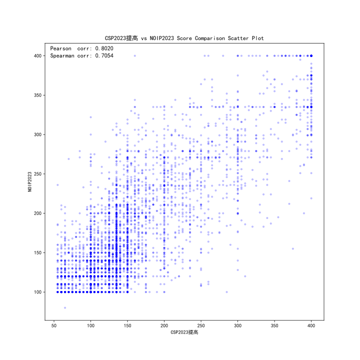
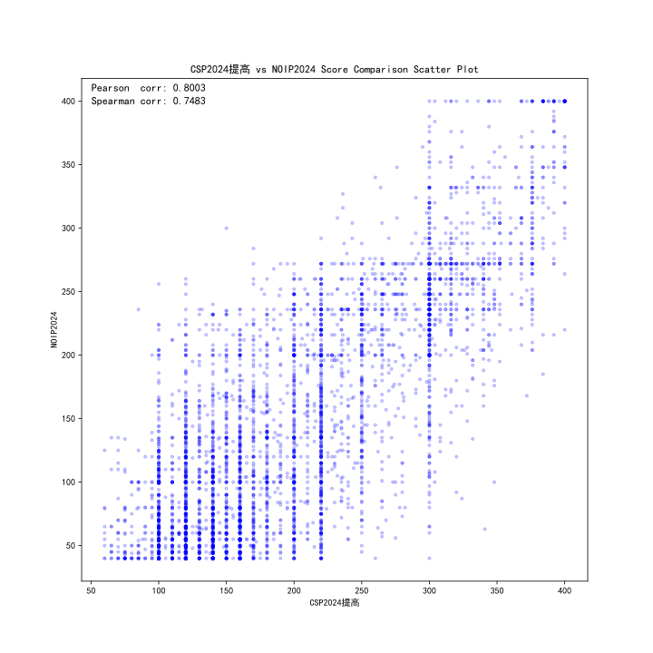
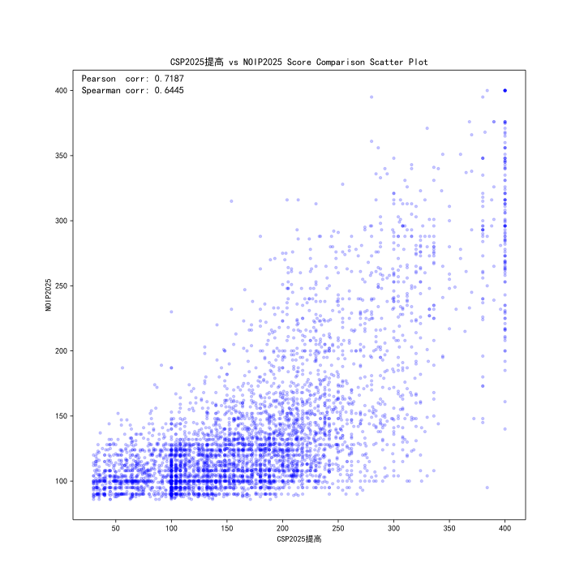
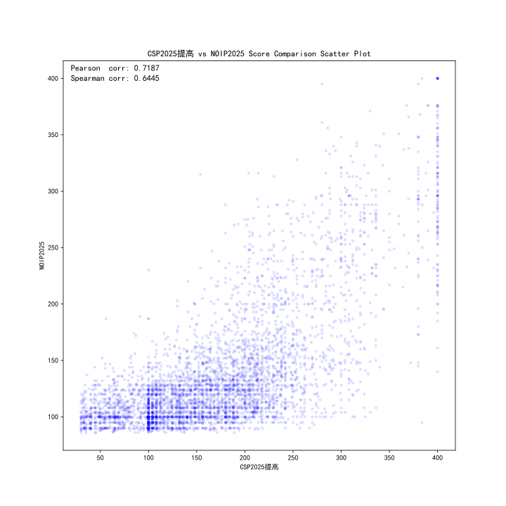
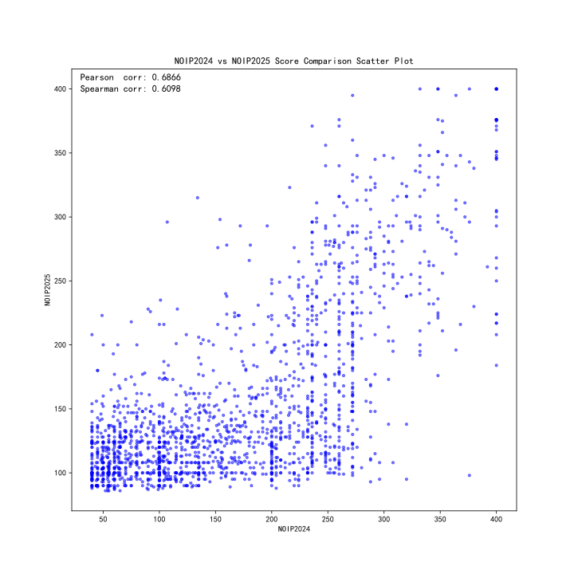

# oier-contest-compare

使用来自 OIerDB 的数据对比选手比赛成绩。

## Sample Usage

直接显示散点图：

```bash
python main.py CSP2025提高 NOIP2025
```

保存为 PNG 文件并设置透明度：

```bash
python main.py CSP2025提高 NOIP2025 --save comparison.png --alpha 0.2
```

也可以保存为 svg 格式：

```bash
python main.py CSP2025提高 NOIP2025 --save comparison.svg --alpha 0.2
```

## Arguments

可以参考命令行帮助：

```bash
python main.py --help
```

```plaintext
usage: main.py [-h] [--dpi DPI] [--alpha ALPHA] [--save SAVE] [--no-show] contest_a contest_b

Compare contest results of OIers.

positional arguments:
  contest_a      Name of contest A
  contest_b      Name of contest B

options:
  -h, --help     show this help message and exit
  --dpi DPI      DPI for the plot
  --alpha ALPHA  Alpha transparency for scatter points
  --save SAVE    Path to save the plot image
  --no-show      Do not display the plot
```

## Sample Output

### CSP2023 vs NOIP2023 (alpha=0.2)



### CSP2024 vs NOIP2024 (alpha=0.2)



### CSP2025 vs NOIP2025 (alpha=0.2)



### CSP2025 vs NOIP2025 (alpha=0.1)



### NOIP2024 vs NOIP2025 (alpha=0.5)


